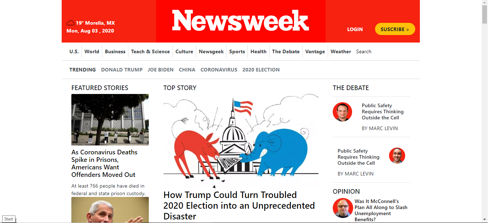

# Newsweek-clone

> This is a collaborative project that use Boostrap for a responsive design and css style : a part of microverse HTML/CSS assignement . initiated and implemented by  Jose and Sanad

## Built With

- html & css,
- Visual Studio Code, Git and Github.

## Live Demo
[Live Demo Link](https://raw.githack.com/sanadwj/Newsweek-clone/feature-branch/index.html)

## Authors

👤 **Author1**

- Github: [@pastorp3](https://github.com/pastorp3)
- Twitter: [@jose_pastor](https://twitter.com/jose_pastorp3 )
- Linkedin: [linkedin](https://www.linkedin.com/in/jos%C3%A9-pedraza-acevedo-ab700a1a9/)

👤 **Author2**

- Github: [@sanadwj](https://github.com/sanadwj)
- Twitter: [@sandooog](https://twitter.com/sandooog)
- Linkedin: [Sanad-Abujbara](https://linkedin.com/in/sanad-abujbara)

## 🤝 Contributing

Contributions, issues and feature requests are welcome!

Feel free to check the [issues page](https://github.com/sanadwj/Newsweek-clone/issues).

## Show your support

Give a ⭐️ if you like this project!

## Acknowledgments

- Hat tip to anyone whose code was used
- Inspiration
- etc

## 📝 License

This project is [MIT](lic.url) licensed.
